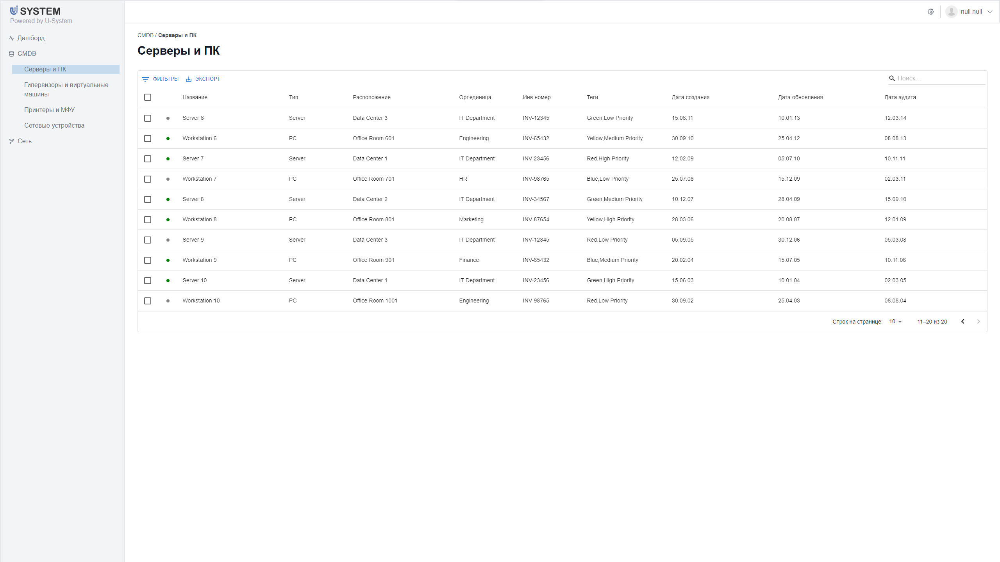
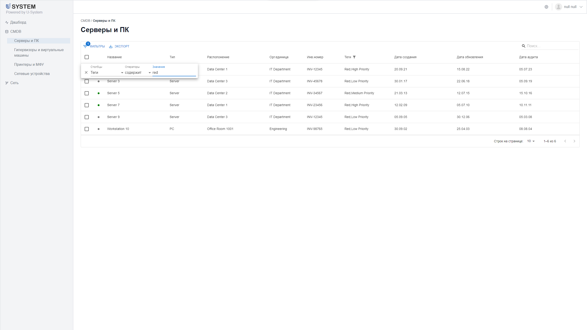
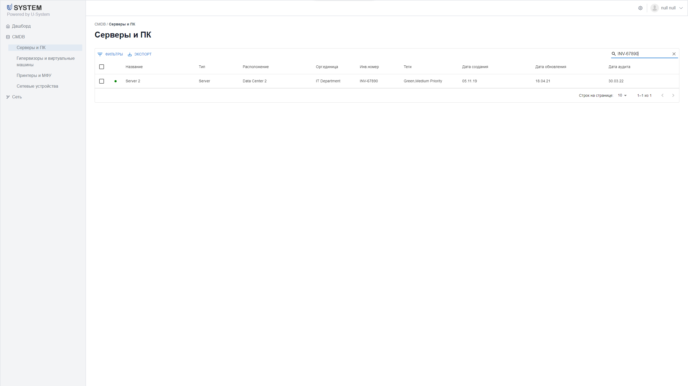

# Тестовое задание для компании U-System
Данный проект реализован с целью получения позиции стажера.
Превью сайта можно посмотреть [здесь](https://lenoricus.github.io/u_system_test_task/).

## Начало работы
Клонируйте репозиторий на свой компьютер:
```
git clone https://github.com/Lenoricus/u_system_test_task.git
```
Перейдите в папку проекта:
```
cd  u_system_test_task
```
Установите зависимости с помощью менеджера пакетов я npm:
```
npm install
```
Запустите проект:
```
npm start
```
Откройте в браузере страницу http://localhost:5173/ для просмотра проекта.

## Функциональность
Пользователи могут просматривать список существующих серверов и ПК, а также находить определенные записи при помощи фильтрации информации.

## Стек технологий
В этом проекте использованы следующие технологии:

+ React - библиотека для создания пользовательских интерфейсов;
+ React Router - для управления маршрутизацией приложения;
+ Tailwind CSS - UI-фреймворк для упрощения стилизации.

React был выбран для создания пользовательского интерфейса, потому что он позволяет создавать компоненты, которые могут быть многократно использованы на разных страницах сайта. Typescript был выбран, потому что он позволяет создавать более надежный и поддерживаемый код, чем обычный JavaScript.

## Внешний вид приложения
### Без фильтрации данных


### Фильтрация данных


### Быстрый поиск по данным

